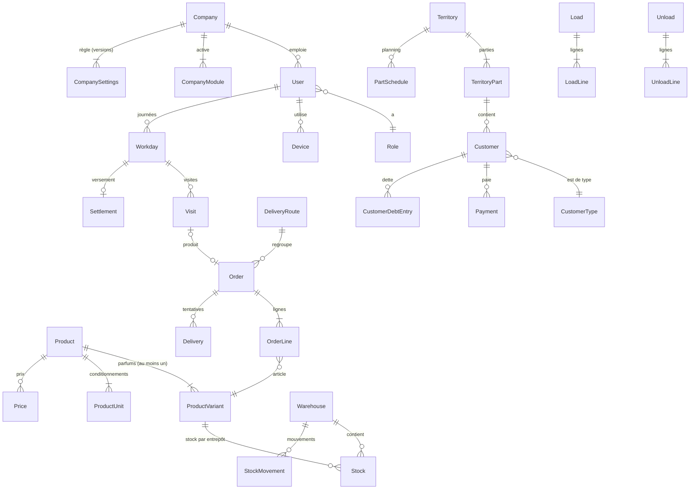

# Base de données — SellWasl

> **Phase 1 — rédigé le 2026-10-02.**
> Ce document décrit le schéma PostgreSQL du MVP, tel qu'il sera écrit avec Prisma en phase 3. Il applique les décisions de l'[architecture](architecture.md) (ARC-xx) et les [règles métier](business-rules.md) (BR-XXX-nn).
>
> Documents liés : [api.md](api.md), [rbac.md](rbac.md), [modules.md](modules.md).

## Sommaire

1. [Conventions](#1-conventions)
2. [Vue d'ensemble](#2-vue-densemble)
3. [Plateforme](#3-plateforme)
4. [Entreprise, utilisateurs et appareils](#4-entreprise-utilisateurs-et-appareils)
5. [Paramétrage](#5-paramétrage)
6. [Catalogue et prix](#6-catalogue-et-prix)
7. [Organisation du terrain](#7-organisation-du-terrain)
8. [Clients](#8-clients)
9. [Quotas et objectifs](#9-quotas-et-objectifs)
10. [Journées et visites](#10-journées-et-visites)
11. [Commandes et ventes](#11-commandes-et-ventes)
12. [Stock](#12-stock)
13. [Préparation et livraison](#13-préparation-et-livraison)
14. [Paiements, dettes et versements](#14-paiements-dettes-et-versements)
15. [Synchronisation, notifications, audit, fichiers](#15-synchronisation-notifications-audit-fichiers)
16. [Calculs et invariants](#16-calculs-et-invariants)
17. [Données téléchargées par le téléphone](#17-données-téléchargées-par-le-téléphone)
18. [Seed de développement](#18-seed-de-développement)
19. [Écarts avec la liste d'entités du plan](#19-écarts-avec-la-liste-dentités-du-plan)

---

## 1. Conventions

### 1.1 Nommage et types

| Sujet | Convention |
|---|---|
| Noms | Modèles Prisma en `PascalCase` anglais (`OrderLine`) ; tables et colonnes en `snake_case` (`order_line`, `company_id`) par `@@map` et `@map` |
| Identifiants | `id UUID`, en UUID v7, généré par l'application (téléphone ou serveur), jamais par la base |
| Montants | `BIGINT`, en **dinars entiers** (ARC-05). Colonnes suffixées `_amount` ou `_price` |
| Quantités | `INTEGER`, en **unité de base** (BR-CAT-02). Colonnes suffixées `_qty` |
| Instants | `TIMESTAMPTZ`, en UTC. Colonnes suffixées `_at` |
| Dates métier | `DATE`, dans le fuseau de l'entreprise (journée, livraison, quota). Colonnes suffixées `_date`, ou `date` |
| Codes et statuts | Énumérations PostgreSQL, en `SCREAMING_SNAKE_CASE` |
| Booléens | Préfixés `is_` ou `has_` |

### 1.2 Colonnes communes

**Toutes les tables d'entreprise** ont :

| Colonne | Rôle |
|---|---|
| `id` | UUID v7 |
| `company_id` | Entreprise propriétaire, renseignée et filtrée automatiquement (ARC-02) |
| `created_at`, `updated_at` | Horodatage serveur |

**Les tables synchronisées** (marquées **S** dans ce document) ont en plus :

| Colonne | Rôle |
|---|---|
| `deleted_at` | Suppression logique, transmise au téléphone comme un changement |
| `version` | Incrémentée à chaque modification ; sert à détecter une écriture concurrente sur le Web |
| `change_seq` | `BIGINT`, alimenté par la séquence globale `sync_change_seq` à chaque création ou modification, par un trigger PostgreSQL. C'est le curseur de synchronisation (architecture §10.3). Index `(company_id, change_seq)` |
| `created_by_user_id`, `created_by_device_id` | Auteur de l'opération (BR-USR-09). L'appareil est vide pour une action faite sur le Web |

Les données **créées par le téléphone** (marquées **T**) gardent en plus `occurred_at`, l'heure de l'action sur le téléphone, distincte de `created_at`, l'heure de réception par le serveur (BR-JOU-11).

### 1.3 Index et contraintes

- `company_id` est **la première colonne** de chaque index composite et de chaque contrainte d'unicité métier : `UNIQUE (company_id, code)`.
- Les contraintes `CHECK` protègent les invariants simples : quantités et montants positifs, stock jamais négatif (BR-STK-04).
- Les colonnes facultatives d'une contrainte d'unicité utilisent `NULLS NOT DISTINCT` (PostgreSQL 15 et plus) : deux prix sans parfum pour le même produit sont bien des doublons.
- Les clés étrangères pointent toujours vers une ligne de la même entreprise. La base ne peut pas le vérifier seule ; c'est le rôle du filtre automatique, et des tests d'isolation (phase 5).

---

## 2. Vue d'ensemble



**Décision clé : tout article est une ligne de `ProductVariant`.** Un produit sans parfum a un seul parfum, dit « par défaut » (`is_default = true`), invisible pour l'utilisateur. Le stock, les quotas, les lignes de commande, les chargements et les inventaires pointent donc toujours vers `product_variant_id`, sans cas particulier (BR-CAT-13).

---

## 3. Plateforme

Ces tables n'ont pas de `company_id` (sauf l'audit). Elles ne sont lues que par le module `platform`.

| Table | Colonnes principales | Contraintes |
|---|---|---|
| `PlatformUser` | `email`, `password_hash`, `name`, `role` (`SUPER_ADMIN`), `status` (`ACTIVE`, `DISABLED`), `last_login_at` | `UNIQUE (email)` |
| `PlatformSession` | `platform_user_id`, `refresh_token_hash`, `family_id`, `expires_at`, `revoked_at`, `ip`, `user_agent` | |
| `PlatformAuditLog` | `platform_user_id`, `action`, `company_id` (facultatif), `entity`, `entity_id`, `before`, `after` (`jsonb`), `ip`, `user_agent`, `created_at` | Ajout seul |
| `Company` | `name`, `code` (court, unique), `mode` (`PRE_SALES`, `CASH_VAN`, `MIXED`), `status` (`TRIAL`, `ACTIVE`, `SUSPENDED`, `CANCELLED`, `DELETED`), `timezone` (`Africa/Algiers`), `created_by_platform_user_id` | `UNIQUE (code)` |

Les tables `SubscriptionPlan`, `PlanModule` et `Subscription` ne sont **pas créées dans le MVP** (plan, phase 31).

---

## 4. Entreprise, utilisateurs et appareils

| Table | Colonnes principales | Contraintes et index |
|---|---|---|
| `CompanyModule` | `module_code` (`PRE_SALES`, `DELIVERY`, `CASH_VAN`, `WAREHOUSE`, `ANALYTICS`), `status` (`ACTIVE`, `INACTIVE`), `activated_at`, `deactivated_at`, `config` (`jsonb`) | `UNIQUE (company_id, module_code)` |
| `CompanySettings` | `version` (entier), `data` (`jsonb`, validé par le schéma Zod des paramètres), `created_by_user_id` | `UNIQUE (company_id, version)`. Lignes **jamais modifiées** : chaque changement crée une version (ARC-12) |
| `Role` | `code` (`COMPANY_ADMIN`, `SUPERVISEUR`, `COMPTABLE`, `PRE_VENDEUR`, `LIVREUR`, `VENDEUR_CASH_VAN`, `MAGASINIER`), `name`, `channel` (`WEB`, `MOBILE`), `is_system` | `UNIQUE (company_id, code)` |
| `Permission` | `code` (`orders.create`…), `description`, `scope` (`PLATFORM`, `COMPANY`) | Table de référence globale, sans `company_id`. `UNIQUE (code)` |
| `RolePermission` | `role_id`, `permission_code` | `UNIQUE (role_id, permission_code)` |
| `User` **S** | `code` (libre, BR-USR-10), `first_name`, `last_name`, `phone`, `email` (facultatif), `password_hash`, `role_id`, `status` (`ACTIVE`, `DISABLED`), `must_change_password`, `last_login_at` | `UNIQUE (company_id, code)` ; `UNIQUE (company_id, email)` |
| `Session` | `user_id`, `device_id` (rôles terrain), `channel` (`WEB`, `MOBILE`), `refresh_token_hash`, `family_id`, `expires_at`, `last_used_at`, `revoked_at`, `revoked_reason`, `ip`, `user_agent` | Index `(company_id, user_id)` ; `UNIQUE (refresh_token_hash)` |
| `Device` | `user_id`, `series` (lettre `A`, `B`…, ARC-11), `status` (`ACTIVE`, `REVOKED`, `BLOCKED`), `name`, `model`, `os_version`, `app_version`, `push_token`, `activated_at`, `revoked_at`, `last_seen_at`, `last_sync_at`, `battery_level`, `pending_ops`, `last_device_seq`, `last_latitude`, `last_longitude`, `last_position_at` | Un seul appareil `ACTIVE` par utilisateur : index unique partiel `(company_id, user_id) WHERE status = 'ACTIVE'` (BR-USR-06). `UNIQUE (company_id, user_id, series)` |
| `DeviceActivationCode` | `user_id`, `code_hash`, `expires_at` (10 min), `used_at`, `used_by_device_id`, `created_by_user_id` | Usage unique (ARC-04) |
| `DevicePing` | `user_id`, `device_id`, `workday_id`, `latitude`, `longitude`, `accuracy_m`, `battery_level`, `pending_ops`, `recorded_at` | Index `(company_id, user_id, recorded_at)`. Enregistré **seulement pendant une journée en cours** (BR-JOU-09). Conservé 90 jours, puis supprimé |

Un utilisateur a **un seul rôle** (BR-USR-01) : `User.role_id` remplace la table `UserRole` du plan.

---

## 5. Paramétrage

| Table | Colonnes principales | Contraintes |
|---|---|---|
| `CustomerType` **S** | `code`, `name`, `is_active` | `UNIQUE (company_id, code)`. Défaut : « Détail » (BR-TEN-07) |
| `Holiday` **S** | `date`, `label` | `UNIQUE (company_id, date)` |
| `Reason` **S** | `kind` (`NO_ORDER`, `DELIVERY_FAILURE`, `ADJUSTMENT`, `FORCED_CLOSE`, `REOPEN`), `system_code` (facultatif), `label`, `is_active`, `sort_order` | `UNIQUE (company_id, kind, label)` |
| `Warehouse` **S** | `type` (`DEPOT`, `TRUCK`), `code`, `name`, `plate_number` (camion), `assigned_user_id` (camion : livreur ou vendeur cash van), `is_active` | `UNIQUE (company_id, code)` ; un camion par utilisateur : index unique partiel `(company_id, assigned_user_id) WHERE type = 'TRUCK'` |

**Motifs système.** Certains motifs déclenchent un comportement : ils portent un `system_code` que l'entreprise ne peut pas supprimer, seulement renommer.

| `system_code` | Type | Effet |
|---|---|---|
| `CUSTOMER_ABSENT` | `NO_ORDER`, `DELIVERY_FAILURE` | Reprogrammation de la livraison (P-05) |
| `STORE_CLOSED` | `NO_ORDER`, `DELIVERY_FAILURE` | Idem |
| `CLOSED_PERMANENTLY` | `NO_ORDER` | Client ajouté aux « clients à revoir » (BR-VIS-05) |
| `REFUSED` | `DELIVERY_FAILURE` | Échec définitif |
| `NOT_DELIVERED` | `DELIVERY_FAILURE` | Livraison non traitée à la clôture (BR-LIV-04) ; reprogrammable |

**Paramètres de l'entreprise** (`CompanySettings.data`) : jours travaillés, distance hors zone, largeur du ticket, intervalle d'envoi de la position, en-tête des bons (BR-TEN-06, BR-TEN-07), et les paramètres réglables P-01 à P-10 (BR-TEN-08). Ce sont des réglages simples, sans relation : un document `jsonb` versionné est plus simple que dix tables.

```json
{
  "workingDays": ["SAT", "SUN", "MON", "TUE", "WED", "THU"],
  "outOfZoneDistanceM": 100,
  "ticketWidthMm": 58,
  "positionIntervalMin": 5,
  "receiptHeader": { "name": "…", "address": "…", "phone": "…" },
  "rules": {
    "P01_workOnNonWorkingDays": true,
    "P02_outOfProgramVisits": true,
    "P03_bonusConsumesQuota": false,
    "P04_recalculateOnDecrease": true,
    "P05_rescheduleFailedDelivery": true,
    "P06_fullUnload": true,
    "P07_multipleCashVanLoads": true,
    "P08_driverCollectsOldDebts": true,
    "P09_newCustomerActiveImmediately": true,
    "P10_supervisorEditsPrices": false
  }
}
```

---

## 6. Catalogue et prix

| Table | Colonnes principales | Contraintes |
|---|---|---|
| `ProductRange` **S** (gamme) | `code`, `name`, `is_active` | `UNIQUE (company_id, code)` |
| `ProductCategory` **S** | `name`, `is_active` | `UNIQUE (company_id, name)` |
| `Product` **S** | `reference`, `name`, `range_id`, `category_id`, `is_active` | `UNIQUE (company_id, reference)` |
| `ProductVariant` **S** (parfum ou article) | `product_id`, `reference`, `name`, `is_default`, `is_active`, `sort_order` | `UNIQUE (company_id, reference)` ; un seul parfum par défaut par produit : index unique partiel `(product_id) WHERE is_default` |
| `ProductUnit` **S** (unité et conditionnements) | `product_id`, `name` (« triplette », « carton »), `base_qty` (nombre d'unités de base ; 1 pour l'unité de base), `is_base`, `is_active` | `UNIQUE (product_id, name)` ; une seule unité de base par produit ; `CHECK (base_qty >= 1)` |
| `Price` **S** | `product_id`, `product_variant_id` (vide = prix du produit ; rempli = prix propre du parfum, BR-CAT-14), `customer_type_id`, `unit_id`, `price` | `UNIQUE NULLS NOT DISTINCT (company_id, product_id, product_variant_id, customer_type_id, unit_id)` ; `CHECK (price >= 0)` |
| `PriceTier` **S** (palier) | `product_id`, `product_variant_id` (vide = palier du produit), `customer_type_id`, `unit_id`, `min_qty` (dans l'unité du palier), `unit_price`, `threshold_scope` (`ALL_VARIANTS`, `PER_VARIANT`) | `UNIQUE NULLS NOT DISTINCT (company_id, product_id, product_variant_id, customer_type_id, unit_id, min_qty)` |
| `BonusRule` **S** | `name`, `buy_product_id`, `buy_variant_id` (vide = tous parfums cumulés), `buy_qty`, `buy_unit_id`, `free_product_id`, `free_variant_id`, `free_variant_mode` (`FIXED`, `SELLER_CHOICE`, `AUTO_MOST_STOCK`), `free_qty`, `free_unit_id`, `valid_from`, `valid_to`, `is_active` | `CHECK (buy_qty > 0 AND free_qty > 0)` ; `free_variant_id` obligatoire si le mode est `FIXED` |
| `BonusRuleCustomerType` | `bonus_rule_id`, `customer_type_id` | Aucune ligne = règle valable pour tous les types (BR-CAT-06) |

**Prix applicable** à un article pour un client : le prix propre du parfum s'il existe pour le type du client et l'unité, sinon le prix du produit. Sans l'un ni l'autre, l'article n'est pas proposé (BR-CAT-04).

**Historique des prix** : les commandes copient le prix, le palier et la règle de bonus appliqués (§11). L'historique des modifications du catalogue est dans l'audit (BR-AUD-01). Il n'y a donc pas besoin de dates de validité sur les prix dans le MVP.

---

## 7. Organisation du terrain

| Table | Colonnes principales | Contraintes |
|---|---|---|
| `Territory` **S** (secteur) | `code` (libre, ex. `3101`), `name`, `seller_user_id` (pré-vendeur ou vendeur cash van), `delivery_user_id` (livreur, prévente), `part_count`, `is_active` | `UNIQUE (company_id, code)` ; un secteur par vendeur : `UNIQUE (company_id, seller_user_id)` (BR-ORG-01) |
| `TerritoryCustomerType` **S** | `territory_id`, `customer_type_id` | `UNIQUE (territory_id, customer_type_id)` |
| `TerritoryPart` **S** (partie) | `territory_id`, `number`, `name`, `geojson` (`jsonb`, polygone GeoJSON), `min_lat`, `max_lat`, `min_lng`, `max_lng` | `UNIQUE (territory_id, number)` (ARC-09) |
| `PartSchedule` **S** | `territory_id`, `weekday` (`SAT`…`FRI`), `part_id` | `UNIQUE (territory_id, weekday)` (BR-ORG-07) |

L'affectation d'un vendeur à son secteur est une colonne de `Territory`, puisqu'un vendeur n'a qu'un secteur et un secteur qu'un vendeur. Elle remplace la table `SalesRepAssignment` du plan ; l'historique des affectations est dans l'audit.

Le chevauchement de deux secteurs d'un même type de clients (BR-ORG-03) et des parties d'un même secteur (BR-ORG-02) est vérifié par l'application, avec Turf, à l'enregistrement d'un polygone.

---

## 8. Clients

| Table | Colonnes principales | Contraintes et index |
|---|---|---|
| `Customer` **S T** | `code` (facultatif), `name`, `phone`, `address`, `customer_type_id`, `latitude`, `longitude`, `territory_id`, `part_id` (vide = hors partie), `is_part_forced`, `frequency` (`WEEKLY`, `BIWEEKLY`, `EVERY_4_WEEKS`), `reference_date`, `is_credit_allowed`, `credit_limit_amount`, `debt_amount`, `status` (`ACTIVE`, `INACTIVE`), `is_new`, `is_cash_only` (P-09), `is_closed_permanently` | Index `(company_id, territory_id, part_id)` ; `CHECK (credit_limit_amount >= 0)` |
| `CustomerReschedule` **S** | `customer_id`, `date`, `created_by_user_id` | `UNIQUE (company_id, customer_id, date)` (BR-PLA-05) |

- `debt_amount` est une **valeur calculée et stockée**, mise à jour dans la même transaction que chaque écriture de `CustomerDebtEntry` (§14). Elle peut toujours être recalculée.
- Un client créé par un vendeur a `created_by_device_id` renseigné, `is_new = true` et, si P-09 l'exige, `is_cash_only = true` jusqu'à sa validation.
- Les contacts et adresses multiples (`CustomerContact`, `CustomerAddress`) viennent après le MVP.

---

## 9. Quotas et objectifs

| Table | Colonnes principales | Contraintes |
|---|---|---|
| `Quota` **S** | `user_id`, `product_variant_id`, `date`, `qty` (unité de base), `entered_unit_id`, `entered_qty` | `UNIQUE (company_id, user_id, product_variant_id, date)` (BR-QUO-01) |
| `Objective` **S** | `user_id`, `range_id`, `month` (premier jour du mois), `target_amount`, `bonus_amount`, `cap_percent` | `UNIQUE (company_id, user_id, range_id, month)` (BR-OBJ-01) |
| `LostDemand` **S T** | `kind` (`LOST_SALE` : ligne en attente refusée ; `LOST_DEMAND` : quota épuisé en cash van), `user_id`, `customer_id`, `product_variant_id`, `qty`, `date`, `order_line_id` (vente perdue) | Index `(company_id, date)` (BR-QUO-04, BR-QUO-06) |

Le quota restant n'est pas stocké : il se calcule à partir des lignes confirmées du jour (§16).

---

## 10. Journées et visites

| Table | Colonnes principales | Contraintes |
|---|---|---|
| `Workday` **S T** | `user_id`, `device_id`, `date`, `status` (`NOT_STARTED`, `IN_PROGRESS`, `CLOSED`), `started_at`, `closed_at`, `is_started_offline`, `is_closed_offline`, `is_force_closed`, `force_close_reason_id`, `force_closed_by_user_id`, `reopen_count`, `settings_version`, `expected_cash_amount` | `UNIQUE (company_id, user_id, date)` (BR-JOU-01) |
| `Visit` **S T** | `workday_id`, `user_id`, `customer_id`, `date`, `mode` (`ON_SITE`, `PHONE`), `status` (`PLANNED`, `IN_PROGRESS`, `COMPLETED`, `MISSED`), `is_scheduled` (client du jour) , `started_at`, `ended_at`, `latitude`, `longitude`, `distance_m`, `is_out_of_zone`, `is_customer_position_unknown`, `outcome` (`ORDER`, `SALE`, `NO_ORDER`), `reason_id` | Index `(company_id, date, user_id)` ; index `(company_id, customer_id, date)` |

- Les visites `MISSED` sont créées par le serveur à la clôture de la journée (BR-PLA-06). Il n'y a pas de ligne `PLANNED` à l'avance : la liste du jour est **calculée** (BR-PLA-07). Le plan prévoyait une table `VisitSchedule` ; elle n'est pas nécessaire.
- `expected_cash_amount` est le montant attendu du récapitulatif (BR-PAY-07). Il est recalculé si des opérations arrivent après une clôture d'office (BR-JOU-10).

---

## 11. Commandes et ventes

Une commande de prévente et une vente cash van sont toutes deux un `Order` : la vente porte la source `CASH_VAN` et naît au statut `DELIVERED` (BR-CV-04).

| Table | Colonnes principales | Contraintes et index |
|---|---|---|
| `Order` **S T** | `number` (ARC-11), `source` (`PRE_SALES`, `PHONE`, `CASH_VAN`), `status` (BR-CMD-02), `seller_user_id`, `customer_id`, `customer_type_id` (figé), `visit_id`, `workday_id`, `order_date`, `delivery_date`, `route_id`, `total_amount`, `reschedule_count`, `confirmed_at`, `locked_at`, `cancelled_at` | `UNIQUE (company_id, number)` ; `UNIQUE (company_id, visit_id)` (BR-VIS-09) ; index `(company_id, delivery_date, status)` ; index `(company_id, seller_user_id, order_date)` |
| `OrderLine` **S T** | `order_id`, `product_id`, `product_variant_id`, `kind` (`NORMAL`, `PENDING`, `BONUS`), `pending_status` (`TO_PROCESS`, `ACCEPTED`, `REFUSED`), `unit_id`, `entered_qty` (dans l'unité choisie), `ordered_qty`, `reserved_qty`, `prepared_qty`, `delivered_qty` (unité de base), `unit_price` (figé), `price_tier_id` (figé), `bonus_rule_id` (ligne bonus), `line_amount`, `is_stockout`, `is_bonus_reduced`, `processed_by_user_id`, `processed_at` | Une ligne normale et une ligne en attente au plus par article et par commande : `UNIQUE (order_id, product_variant_id, kind) WHERE kind <> 'BONUS'` (BR-CMD-01) |

**Quantités d'une ligne**, toutes en unité de base :

```text
ordered_qty    demandée par le client (après scission du quota)
reserved_qty   réservée au dépôt à la confirmation (≤ ordered_qty ; inférieure = rupture)
prepared_qty   préparée par le magasinier
delivered_qty  livrée (ou vendue, en cash van)
```

`line_amount` est recalculé à chaque baisse de quantité, avec les paliers et les bonus figés, si P-04 le demande (BR-CAT-10).

---

## 12. Stock

| Table | Colonnes principales | Contraintes |
|---|---|---|
| `Stock` **S** | `warehouse_id`, `product_variant_id`, `physical_qty`, `reserved_qty` | `UNIQUE (company_id, warehouse_id, product_variant_id)` ; `CHECK (physical_qty >= 0 AND reserved_qty >= 0 AND reserved_qty <= physical_qty)` (BR-STK-04) |
| `StockMovement` | `type` (`IN`, `OUT`, `TRANSFER`, `RESERVATION`, `RELEASE`, `ADJUSTMENT`), `product_variant_id`, `qty`, `from_warehouse_id`, `to_warehouse_id`, `reason_id`, `source_type` (`ORDER`, `DELIVERY`, `LOAD`, `UNLOAD`, `RECEIPT`, `INVENTORY`), `source_id`, `user_id`, `device_id`, `occurred_at` | Ajout seul ; `CHECK (qty > 0)` ; index `(company_id, product_variant_id, occurred_at)` |
| `StockReceipt` **S T** (entrée au dépôt) | `warehouse_id`, `reference`, `supplier`, `received_at` | |
| `StockReceiptLine` **S T** | `receipt_id`, `product_variant_id`, `unit_id`, `entered_qty`, `qty` | |
| `InventoryCount` **S T** | `warehouse_id`, `status` (`DRAFT`, `VALIDATED`), `validated_at` | |
| `InventoryCountLine` **S T** | `inventory_count_id`, `product_variant_id`, `expected_qty`, `counted_qty`, `gap_qty` | |
| `Load` **S T** (chargement) | `kind` (`ROUTE` : tournée de prévente ; `CASH_VAN` ; `RELOAD` : rechargement, P-07), `truck_id`, `user_id` (livreur ou vendeur), `date`, `route_id`, `status` (`PLANNED`, `LOADED`, `RECEIVED`), `has_gap`, `planned_by_user_id`, `loaded_by_user_id`, `loaded_at`, `received_at` | Index `(company_id, truck_id, date)` |
| `LoadLine` **S T** | `load_id`, `product_variant_id`, `planned_qty`, `loaded_qty`, `received_qty` | `UNIQUE (load_id, product_variant_id)` |
| `Unload` **S T** (déchargement) | `truck_id`, `user_id`, `workday_id`, `date`, `status` (`DRAFT`, `VALIDATED`), `keeps_stock_in_truck` (P-06), `validated_by_user_id`, `validated_at` | `UNIQUE (company_id, workday_id)` |
| `UnloadLine` **S T** | `unload_id`, `product_variant_id`, `loaded_qty`, `delivered_qty`, `free_qty`, `theoretical_qty`, `counted_qty`, `gap_qty` | (BR-STK-07) |

- Le stock d'un camion est une ligne `Stock` dont l'entrepôt est de type `TRUCK`. Le `reserved_qty` n'est utilisé qu'au dépôt (BR-STK-02).
- Le **stock disponible** n'est pas stocké : `disponible = physical_qty − reserved_qty`.
- Les emplacements (`WarehouseLocation`) et les transferts entre dépôts viennent après le MVP.

---

## 13. Préparation et livraison

| Table | Colonnes principales | Contraintes |
|---|---|---|
| `DeliveryRoute` **S** (tournée) | `delivery_user_id`, `truck_id`, `delivery_date`, `status` (`DRAFT`, `PREPARING`, `READY`, `LOADED`, `OUT_FOR_DELIVERY`, `CLOSED`), `launched_by_user_id`, `launched_at` | `UNIQUE (company_id, delivery_user_id, delivery_date)` (BR-PRE-01) |
| `Delivery` **S T** (une tentative de livraison) | `order_id`, `route_id`, `workday_id`, `user_id`, `number` (bon, ARC-11), `attempt` (1 ou 2, P-05), `result` (`DELIVERED`, `PARTIAL`, `FAILED`), `reason_id`, `latitude`, `longitude`, `delivered_amount`, `occurred_at` | `UNIQUE (company_id, number)` ; `UNIQUE (company_id, order_id, attempt)` |

- Les quantités livrées sont dans `OrderLine.delivered_qty` : seule la dernière tentative réussie livre de la marchandise.
- En cash van, la vente crée directement un `Delivery` avec le résultat `DELIVERED`, qui porte le numéro du bon.
- La table `Route` du plan est nommée `DeliveryRoute`, pour éviter la confusion avec les routes de l'API et du Web.

---

## 14. Paiements, dettes et versements

| Table | Colonnes principales | Contraintes |
|---|---|---|
| `Payment` **S T** | `number` (reçu ou bon), `kind` (`DELIVERY_PAYMENT`, `DEBT_PAYMENT`), `customer_id`, `user_id`, `workday_id`, `order_id`, `delivery_id`, `due_amount`, `cash_amount`, `credit_amount`, `occurred_at` | `CHECK (cash_amount >= 0 AND credit_amount >= 0)` ; `due_amount = cash_amount + credit_amount` pour un paiement de livraison |
| `CustomerDebtEntry` | `customer_id`, `kind` (`CREDIT_SALE`, `DEBT_PAYMENT`, `ADVANCE`, `ADVANCE_USED`), `amount` (positif : la dette augmente ; négatif : elle baisse), `payment_id`, `occurred_at` | Ajout seul ; index `(company_id, customer_id, occurred_at)` |
| `Settlement` (versement) | `workday_id`, `accountant_user_id`, `expected_amount`, `remitted_amount`, `gap_amount`, `validated_at`, `is_recalculated` | `UNIQUE (company_id, workday_id)` (BR-PAY-08) |
| `PrintLog` **T** | `document_type` (`DELIVERY_NOTE`, `SALE_NOTE`, `DEBT_RECEIPT`, `DAY_SUMMARY`), `document_id`, `copy_number` (1 = original ; 2 et plus = DUPLICATA), `user_id`, `device_id`, `printed_at` | (BR-IMP-03) |

- La **dette** d'un client est la somme de ses `CustomerDebtEntry` (BR-PAY-04). `Customer.debt_amount` en est la copie à jour.
- Une avance (BR-PAY-04, double encaissement hors connexion) est une écriture `ADVANCE` négative ; elle est consommée sur le bon suivant par une écriture `ADVANCE_USED`.

---

## 15. Synchronisation, notifications, audit, fichiers

| Table | Colonnes principales | Contraintes |
|---|---|---|
| `SyncOperation` | `op_id` (UUID du téléphone), `device_id`, `user_id`, `device_seq`, `type`, `payload` (`jsonb`), `status` (`APPLIED`, `APPLIED_WITH_CHANGES`, `REJECTED`), `result` (`jsonb`), `error_code`, `occurred_at`, `received_at` | `UNIQUE (company_id, op_id)` (BR-SYN-02) ; `UNIQUE (device_id, device_seq)`. Sert aussi de journal de synchronisation (BR-SYN-07). Conservé 12 mois |
| `Notification` **S** | `user_id`, `type`, `title`, `body`, `data` (`jsonb`), `read_at`, `pushed_at` | Index `(company_id, user_id, read_at)` |
| `AuditLog` | `actor_user_id`, `device_id`, `action`, `entity`, `entity_id`, `before`, `after` (`jsonb`), `reason`, `ip`, `user_agent`, `created_at` | **Ajout seul** : l'utilisateur de base de l'application n'a pas les droits `UPDATE` ni `DELETE` sur cette table. Index `(company_id, entity, entity_id)` |
| `StoredFile` | `kind` (`IMPORT`, `EXPORT`, `LOGO`), `storage_key` (`companies/<company_id>/…`), `filename`, `content_type`, `size_bytes`, `created_by_user_id` | |
| `ImportJob` | `kind` (`CUSTOMERS`, `PRODUCTS`), `file_id`, `status` (`PREVIEW`, `IMPORTED`, `FAILED`), `total_rows`, `imported_rows`, `errors` (`jsonb` : ligne et motif) | (BR-IO-01, BR-IO-02) |

---

## 16. Calculs et invariants

Ces valeurs ne sont pas stockées, ou sont stockées comme une copie toujours recalculable. Les fonctions de calcul sont dans `packages/business-rules`.

| Valeur | Calcul |
|---|---|
| Stock disponible | `Stock.physical_qty − Stock.reserved_qty` |
| Quota restant | `Quota.qty − Σ OrderLine.ordered_qty` des lignes `NORMAL` du vendeur, de l'article et du jour, des commandes non annulées, plus les lignes `BONUS` si P-03 est actif. Les lignes `PENDING`, même acceptées, ne le consomment pas : leur acceptation autorise justement le dépassement (BR-QUO-06) |
| Dette du client | `Σ CustomerDebtEntry.amount` |
| Montant attendu d'une journée | `Σ Payment.cash_amount` de la journée |
| Réalisé d'un objectif | `Σ OrderLine.delivered_qty × unit_price` des lignes payantes de la gamme, livrées dans le mois, pour le vendeur (BR-OBJ-02) |
| Théorique d'un déchargement | chargé − livré ou vendu − offert (BR-STK-07) |

**Invariants vérifiés par les tests d'intégration** :
- pour chaque entrepôt et article, `Stock.physical_qty` est égal à la somme des mouvements ;
- pour chaque client, `Customer.debt_amount` est égal à la somme de ses écritures de dette ;
- aucune ligne d'une entreprise ne référence une ligne d'une autre entreprise.

**Concurrence** : toute opération qui modifie le stock verrouille les lignes `Stock` concernées (`SELECT … FOR UPDATE`), toujours dans le même ordre (par `product_variant_id`), pour éviter les interblocages.

---

## 17. Données téléchargées par le téléphone

Application de BR-SYN-04. Le serveur filtre chaque table selon le rôle et le périmètre de l'utilisateur.

| Données | Pré-vendeur | Vendeur cash van | Livreur | Magasinier |
|---|---|---|---|---|
| Paramètres, modules, motifs, jours fériés, types de clients | ✓ | ✓ | ✓ | ✓ |
| Catalogue : produits, parfums, unités, gammes | ✓ | ✓ | ✓ | ✓ |
| Prix, paliers, bonus | Types de clients de son secteur | Idem | ✓ (pour le recalcul) | — |
| Secteur, parties, planning | Le sien | Le sien | Ses secteurs | — |
| Clients et dettes | Son secteur | Son secteur | Clients de sa tournée | — |
| Reprogrammations | Son secteur | Son secteur | — | — |
| Quotas | Les siens, du jour | Les siens, du jour | — | — |
| Objectifs | Les siens, du mois | Les siens, du mois | — | — |
| Disponibilité au dépôt | Oui (sans les quantités, BR-CMD-06) | — | — | Stock du dépôt |
| Stock du camion | — | Le sien | Le sien | — |
| Commandes et ventes | Les siennes, 30 derniers jours | Les siennes, 30 derniers jours | Sa tournée | Tournées à préparer |
| Chargements, déchargements | — | Les siens | Les siens | À faire |
| Notifications | Les siennes | Les siennes | Les siennes | Les siennes |

---

## 18. Seed de développement

Deux entreprises, pour tester l'isolation dès la phase 3 (plan, phase 3) :

| | Entreprise A — « Distri Oran » | Entreprise B — « Cash Van Est » |
|---|---|---|
| Mode | Prévente | Cash van |
| Utilisateurs | 1 admin, 1 superviseur, 1 comptable, 2 pré-vendeurs, 1 livreur, 1 magasinier | 1 admin, 1 superviseur, 1 comptable, 2 vendeurs cash van, 1 magasinier |
| Organisation | 2 secteurs (`3101`, `3102`) de 6 parties | 2 secteurs de 6 parties |
| Catalogue | Thon tomate, thon à l'huile, biscuit Bimo (chocolat, fraise, pistache avec prix propre) | Mêmes produits |
| Règles | Paliers et bonus des exemples chiffrés de `business-rules.md` §22 | Idem |
| Stock | Un dépôt, un camion | Un dépôt, deux camions |
| Clients | 30 par secteur dans les parties (5 par partie), plus 2 hors partie | Idem |

Le seed ne s'exécute jamais en production (plan, règle de développement 16). Il est dans `apps/api/prisma/seed.ts` et respecte les invariants du §16 : le stock de départ passe par des mouvements (entrée au dépôt, transfert vers les camions), la dette par une écriture.

**Mise en œuvre (phase 3, 2026-10-03)** : le schéma est dans `apps/api/prisma/schema.prisma` (61 tables). Ce que Prisma ne sait pas exprimer est dans la migration `sync_triggers_and_checks` : séquence `sync_change_seq` et triggers des 38 tables synchronisées, blocage des modifications sur les 4 tables en ajout seul, 24 contraintes `CHECK`. Les unicités avec une colonne facultative (prix, paliers) sont deux index uniques partiels plutôt que `NULLS NOT DISTINCT`.

---

## 19. Écarts avec la liste d'entités du plan

| Entité du plan (phase 3) | Dans ce schéma |
|---|---|
| `UserRole` | Remplacée par `User.role_id` : un seul rôle par utilisateur (BR-USR-01) |
| `Team` | Après le MVP (BR-USR-04) |
| `SalesRepAssignment` | Colonnes `seller_user_id` et `delivery_user_id` de `Territory` |
| `VisitSchedule` | Inutile : la liste du jour est calculée (BR-PLA-07) |
| `VisitOutcomeReason` | Table `Reason`, commune à tous les motifs |
| `Route` | `DeliveryRoute` |
| `Delivery`, `DeliveryItem` | `Delivery` ; les quantités livrées sont sur `OrderLine` |
| `CustomerContact`, `CustomerAddress`, `Zone`, `Promotion`, `WarehouseLocation`, `Attachment` | Après le MVP |
| `SubscriptionPlan`, `PlanModule`, `Subscription` | Après le MVP (phase 31) |
| `Session`, `SyncLog` | `Session` ; le journal de synchronisation est `SyncOperation` |
| Ajouts phase 0 : `WorkDay`, `Load / Unload`, `Settlement`, `PriceTier`, `BonusRule`, `Quota`, `Objective`, `LostDemand`, `Holiday`, `CustomerType`, `ProductPackaging` | Présents ; `ProductPackaging` s'appelle `ProductUnit` |
| Ajouts 2026-10-02 | `ProductVariant` (parfums), `CompanySettings` (BR-TEN-08), `DeviceActivationCode`, `DevicePing`, `CustomerDebtEntry`, `PrintLog`, `StoredFile`, `ImportJob` |
